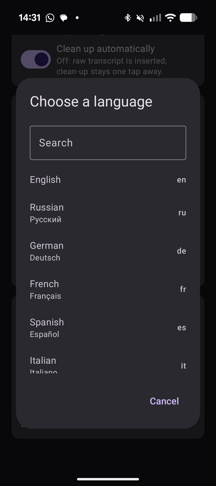

# Tyvo

An Android keyboard that dictates, cleans up what you said, and then lets you
reshape it without leaving the keyboard.

Say:

> "I am going to cook pasta, sorry no, lasagna"

and the field gets:

> I am going to cook lasagna.


## No backend, and no subscription, full privacy, bring-your-own-key

**There is no server.** Tyvo talks to your AI provider directly from your
phone and to nothing else — no account, no sign-up, no telemetry, no analytics,
no crash reporting, nowhere for your voice to end up but the provider you chose.
Your recordings and transcripts stay on the device; your API key is held in
`EncryptedSharedPreferences` and is sent to that one provider and no one else.
Nothing passes through infrastructure belonging to this project, because there
isn't any.

That is also why it is not a subscription. Every dictation app in this space
seems to want £10 a month whether you use it twice or two hundred times, with
your audio flowing through their servers to justify the bill. I got tired of it.
**Bring your own key and pay the provider directly, per second of audio.** A
heavy day costs cents; a quiet week costs nothing. No tier you outgrow, no
seat you forget to cancel, and no middleman with a copy of everything you said.

Pick OpenAI or Mistral, paste a key, done. If a provider disappoints you, switch
— the choice stays yours, which is the point.

Don't take that on trust — it is checkable in a few seconds:

```sh
# every URL the app can reach
grep -rhoE 'https?://[a-zA-Z0-9.-]+' app/src/main/kotlin/ | sort -u
#   https://api.mistral.ai
#   https://api.openai.com

# no analytics, crash reporting or telemetry SDKs
grep -iE "firebase|crashlytics|analytics|sentry|bugsnag" app/build.gradle.kts
```

The dependency list is AndroidX, the Kotlin standard library and OkHttp. The
permissions are `RECORD_AUDIO`, `INTERNET`, `VIBRATE` and `POST_NOTIFICATIONS`
— no contacts, no storage, no location, no device identifiers.

## How it works

```
mic ──▶ WAV (16 kHz mono) ──▶ transcription API ──▶ raw text
                                                      │
                                              inserted immediately
                                                      │
                                                      ▼
                                            LLM clean-up pass
                                                      │
                                              swapped in place
                                                      │
                                                      ▼
                                     review: quick actions · undo · custom
```

Raw text is committed as soon as transcription returns, then replaced by the
polished version. Waiting for both round-trips before showing anything makes
the keyboard feel broken.

## Providers

You pick **one** provider; it handles both stages, so you only ever hold a
single API key.

| Provider  | Transcription | Clean-up |
|-----------|---------------|----------|
| OpenAI    | `gpt-4o-mini-transcribe` | `gpt-4o-mini` |
| Mistral   | `voxtral-mini-latest`    | `ministral-3b-latest` |

Keys and model choices are stored **per provider**, so switching to the other
one and back does not cost you a key you already pasted in.

Note on model names: of the Voxtral family, only `voxtral-mini-*` reports
`audio_transcription` capability. `voxtral-small-latest` does **not**
transcribe despite the name, so overriding the Mistral model carelessly will
break dictation. A unit test guards the default.

## Quick actions

Offered on the review strip after dictation, each one re-editable and undoable:

**Fix** — Proofread · Punctuate · Tighten · → English
**Tone** — Formal · Casual · Warmer · Direct
**Length** — Shorter · Expand · Bullets

Plus a free-text box: type any instruction ("make it sound less annoyed",
"turn this into a Jira ticket") and it applies to the current text.

### How actions compose

Every action transforms the **base** text, never the previous action's output.
Tapping Formal then Shorter gives a short version of the base, not a short
version of the formal rewrite — chaining rewrites compounds the model's drift,
and after three taps you are editing something several steps removed from what
you said. Actions are alternatives to each other; the applied one is
highlighted, and Undo returns to the base.

The base starts as the cleaned-up dictation, because that is what you see and
think of as "your text". **Undo clean-up** swaps it for the raw transcript.
That is lossy on purpose: the cleaned-up version is discarded, and
**Re-clean** produces a fresh one rather than restoring it.

```
raw transcript ──clean up──▶ base ──action──▶ variant (in the field)
      ▲                       │                  │
      └── Undo clean-up ──────┘        Undo ──────┘
```

### Language

Actions never change the language. The instructions are written in English,
which is enough on its own to pull Russian or German text into English, so the
language rule is stated first, repeated at the end, and kept deliberately
*relative* — it never names a language, because naming one made a small model
translate English input into it. Only "→ English" is allowed to change
language, and a typed instruction relaxes the lock only when it actually asks
for a translation.

## Nothing is lost

A failed transcription used to destroy the recording, so the words were simply
gone. Now audio is written to the store and indexed **before** the network is
touched, and deleted only once text exists to replace it. Losing signal,
crashing, or being killed mid-request cannot take a dictation with it.

When transcription fails:

- the keyboard shows the error and a **Retry** chip, so you can try again
  without leaving the field
- a notification says the recording was saved, and opens straight into History
- the recording waits in **History** with its audio, retryable or exportable

**History** lists every dictation, newest first, with unfinished ones pinned to
the top. Transcribed entries keep their text and can be copied; failed and
pending ones keep their WAV and offer Retry and Save audio.

Successful recordings discard their audio the moment they are transcribed —
the text is what you wanted, and 16 kHz mono runs about 1.9 MB per minute.
Anything else loses its audio after 24 hours, swept on app or keyboard start.
**Transcripts are never deleted automatically**; only the audio expires, so an
old entry stops being retryable but never stops being readable.

Settings has *Keep failed recordings indefinitely* for the case where the
audio is the only copy of what you said. It exempts failures only — successful
recordings still expire on schedule.

### How durable is it?

The audio files are the irreplaceable part, and they are written once and
never mutated. The index is a single JSON file, rewritten in full, `fsync`ed,
then renamed over the old one — renaming is atomic for readers, but without
the sync a power loss can leave the renamed file full of zeroes. There is
deliberately no in-place fallback: a failed write that leaves the previous
index intact beats one that truncates it.

The index is also *disposable*. On start-up the store scans for WAVs it has
lost track of and re-adopts them as pending, so even deleting the index
outright costs you metadata rather than recordings.

One known limit: the store is not safe against the app and the keyboard
writing at the same instant, since its lock is per-process. Two simultaneous
writes could lose one update — never a WAV.

## The app

Three screens:

- **Welcome** — shown once, on first run. What the keyboard does, then only
  the three things it cannot work without: an API key, the microphone, and
  enabling Tyvo in Android's keyboard settings. Models, corrections, language
  and retention all have sensible defaults and stay out of the way until
  someone goes looking.
- **History** — home from then on. Every dictation, unfinished ones pinned to
  the top.
- **Settings** — a tap away from History, back returns.

## Setup

1. Install the APK and open **Tyvo**.
2. Grant microphone access.
3. Enable Tyvo in system keyboard settings, then switch to it.
4. Paste API keys. They are stored in `EncryptedSharedPreferences` and sent
   only to the provider you selected.
5. Hit **Test connection** to confirm the key and model work.

## Corrections

Clean-up is a list of things the model is allowed to do, each switchable:

| Correction | Default | What it does |
|---|---|---|
| Spoken corrections | on | "cook pasta, sorry no, lasagna" → "cook lasagna" |
| Filler and false starts | on | Drops "um", "uh", stutters, abandoned clauses |
| Punctuation and capitalisation | on | Adds what speech does not carry |
| Spoken punctuation | on | "question mark" becomes `?` |
| Light grammar | on | Agreement and obvious transcription slips |
| Paragraph breaks | off | Splits long dictation where the topic changes |
| Numbered lists | off | "first… second… next…" becomes a numbered list |
| Numbers and dates | off | "twenty five euros" → "EUR 25" |

Disabled ones are left out of the prompt entirely rather than negated — a
prompt full of "do not do X" reads to a small model as a list of things worth
considering.

**The optional ones cost accuracy.** Measured on `ministral-3b`: the
spoken-correction case passes 3/3 with the five defaults, 1/3 with seven
corrections, and 0/3 with all eight. Longer instruction lists crowd out the
earlier items, so the self-correction rule sits above the list rather than in
it, and settings warns you when you switch extras on. On a larger model the
ceiling is higher.

## Language



One slot, chosen from a searchable list of 45 languages (matching on code,
English name or endonym). Blank means auto-detect, which is the right setting
if you switch languages.

It is one slot rather than a list because the transcription APIs accept
exactly one code — a list would only ever send its first entry, which is a
setting that lies about what it does.

<br clear="right" />

## Vocabulary

Names and jargon the transcriber keeps mangling: product names, colleagues,
technical terms. Sent as a biasing prompt (OpenAI) or `context_bias` terms
(Mistral, max 100). A nudge, not a dictionary.

### How much the language hint actually helps

Mistral documents `language` as an accuracy hint layered on top of
auto-detection, not a constraint — and measured against the live API it has no
observable effect at all:

| Audio | `language` | Result |
|---|---|---|
| Russian | *omitted* | correct Russian |
| Russian | `en` | byte-identical Russian |
| Russian | `bg` | byte-identical Russian |
| Bulgarian | `ru` | byte-identical Bulgarian |
| Russian with English loanwords | all of the above | identical |

An invalid code like `en,ru` is rejected with `422 Invalid language alpha2
code`, so it is validated and then apparently unused. The `language` field in
the *response* is always `null`, even for clear speech with no
`timestamp_granularities` set — undocumented, and it means there is no
detection result to act on either.

Mistral's docs describe it as an accuracy hint layered on top of
auto-detection rather than a constraint, so this is documented behaviour
rather than a fault. OpenAI's claim is stronger — "improve accuracy and
latency", where the latency gain implies detection is genuinely skipped.

Tyvo sends it to both anyway: it costs one form field, and it will take effect
on Mistral if that ever changes.

There is also no way to recover from a mis-detection after the fact. The
response's `language` field is always `null` (even with no
`timestamp_granularities`, the one documented incompatibility), so there is no
detection result to branch on — and re-transcribing with a forced hint
provably returns identical text. A "detect the language during clean-up and
retry" path would have nothing to trigger it and nothing to fix.

## Build

```sh
export JAVA_HOME=$(/usr/libexec/java_home -v 21)
export ANDROID_HOME=/opt/homebrew/share/android-commandlinetools
./gradlew :app:assembleDebug
./gradlew :app:testDebugUnitTest
```

## Design notes

**Why not a full keyboard?** Tyvo does one thing. The globe key returns you to
your usual IME for ordinary typing.

**Text safety.** When replacing polished text, the service checks the field
still ends with exactly what it committed. If you edited it meanwhile, Tyvo
appends instead of overwriting your edit.

**Prompt discipline.** Both prompts explicitly forbid the model answering,
acting on, or translating the content — dictating "what time is the meeting?"
must yield that question, not an answer to it.

## Model selection

Both stages offer a dropdown of curated models plus a **Custom…** option for
any model ID. Blank means "provider default", so defaults can improve without
stranding you on an old pin.

### A note on Mistral tiers

Mistral gates larger models by subscription tier, and reports it as
`HTTP 429 Rate limit exceeded` — which reads like throttling but really means
"not included in your plan". Empirically, on a low tier:

| Model | Result |
|---|---|
| `ministral-3b/8b/14b-latest`, `open-mistral-nemo` | ✅ work |
| `mistral-small-latest`, `mistral-medium-latest`, `magistral-small-latest` | ❌ 429 |
| `mistral-large-latest` | ❌ 403 "not available in your subscription tier" |

The 403 on `large` is what gives the game away: the 429s are the same gating
with a friendlier status code. This is observed behaviour, not documented
policy. **Test connection** in settings tells you which bucket you are in.

## Status

Verified working on a Pixel 10 (Android 17):

- IME registers, is selectable, renders without crashing
- Settings, permissions, encrypted key storage
- Live HTTPS calls to Mistral; errors surface as readable text
- WAV format accepted by the transcription endpoint (HTTP 200)
- Clean-up prompt: 8/8 on a tricky-transcript suite against the real API
- 22 unit tests

Not yet verified end to end: speaking into the mic and getting polished text
back, which needs a working transcription tier plus a human voice.
